# Setup

## Prequisite Software Installations

Install the following software before starting the setup process.

- Unreal Engine 5.3
- Visual Studio Code

## Setup Unreal Project to Use Python

- Open Unreal project
- Choose ***Edit -> Plugins***
    - In the left panel:
        - scroll down to the ***Scripting*** section
    - In the right panel:
        - find ***Python Editor Script Plugin*** and check the enable box
        - find ***Editor Script Utilities*** and check the enable box  

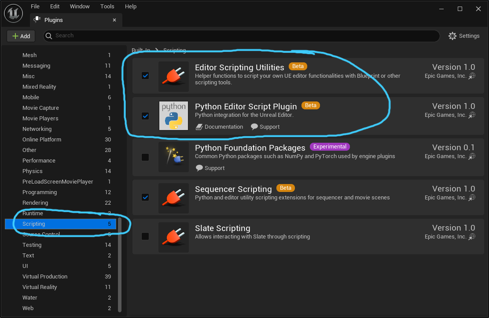  

- Close the plugin dialog window
- Choose ***Edit -> Project Settings***
    - In the left panel:
        - find ***Plugins*** main heading and select ***Python***
    - In the right panel:
        - check the ***Enable Remote Execution?*** checkbox  

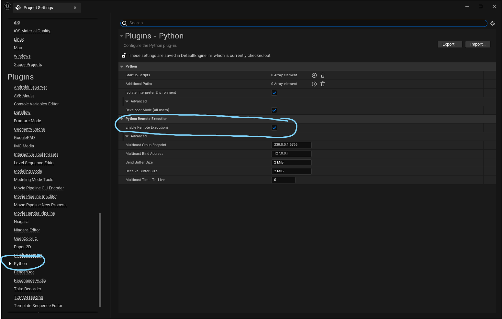

- Close project settings dialog window
- Choose ***Edit -> Editor Preferences***
    - In the left panel:
        - Find ***Plugins*** category and select ***Python***
    - In the right panel:
        - Check ***Developer Mode*** checkbox  

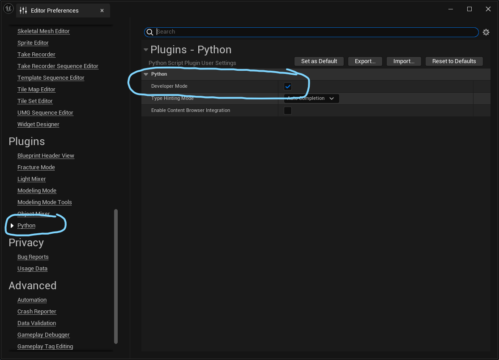  

- Close Editor Preferences dialog window
- Choose ***Edit -> Project Settings***
    - In the left panel:
        - Find and select ***Python***
    - In the right panel:
         - in the advanced area:
             - Check ***Developer Mode (all users)*** checkbox  

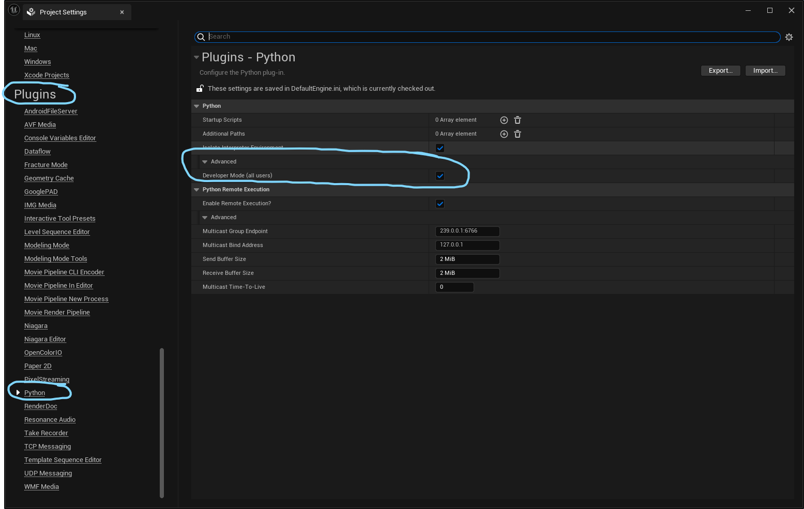  

- Close Project Settings dialog window
- Save all
- Check out any files not already checked out
- Submit changes to perforce
- Restart Unreal Editor *(Close Unreal project and open it again)*

## Python Version Required

Python Editor Script Plugin contains an embedded version of Python 3.9.7. Therefore, the user will not need to install Python on their workstation.

Please refer to the requirements file for the additional modules to install for Python.

### Embedded Python Module Installation Process:

- open a powershell terminal
- Naviate to the embedded Unreal Python installation location:
    - {Unreal Software Install Dir}\Engine\Binaries\ThirdParty\Python3\Win64\
    - **Example:** E:\01_EpicGames\UE_5.3\Engine\Binaries\ThirdParty\Python3\Win64\
- Run the following command and simply change the module for each item listed in the requirements:

```
 .\python.exe -m pip install PyYAML
```
This will install the required modules for the python version embedded within the Unreal Editor.

## Visual Studio Code Setup To Work With Unreal Engine

- Open ***Visual Studio Code***
- On left icon panel, click on the ***Extensions*** button
- At the top of the window, click inside the ***Search Extensions in Marketplace*** text field
     - Search for ***Unreal Engine Python*** extension
        - The author of this extension is Nils Soderman *(use to verify correct plugin extension)*
    - click ***Install***  

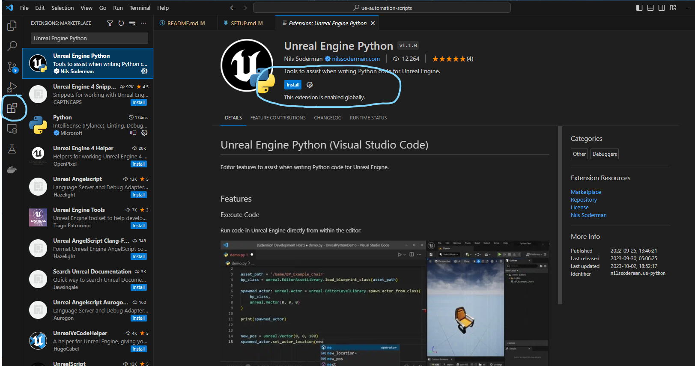

### Setup Unreal Engine Python Plugin
To setup the plugin functionality, run the following commands using the command palette: ***Ctrl + Shift + P***  
This will need to be done for each command to run.

### Setup keyboard shortcut to send Python script to Unreal:

```
Unreal Python: Execute
```

The shortcut will be ***Ctrl + Enter***

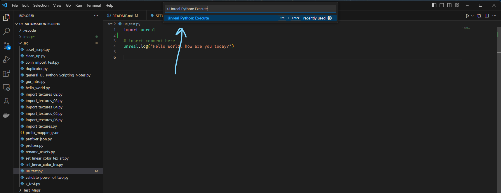

### Setup Unreal Python API Code Completion:

```
Unreal Python: Setup code completion
```
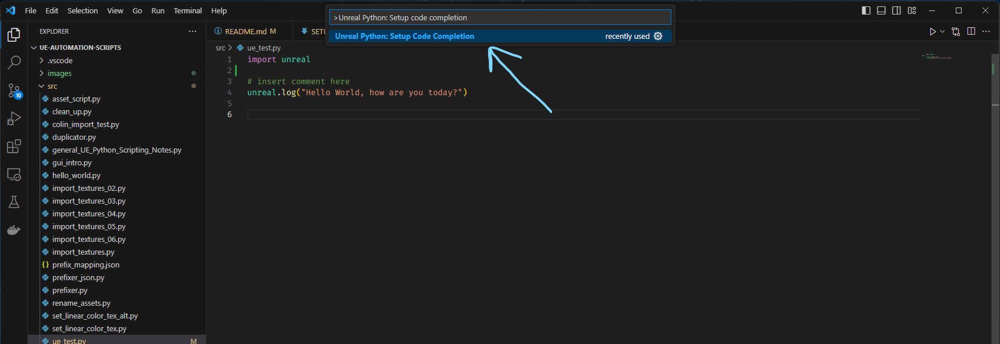

### Setup Debugging:

```
Unreal Python: Attach
```
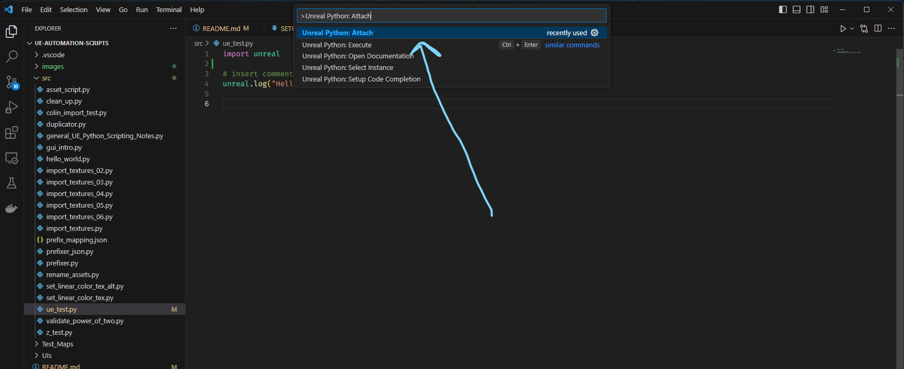

### Setup Python Interpreter:

- Select the interpreter button in the lower right bottom area
    - Once this has been click, look in the top center area within the ***Command Paletter*** for next steps  

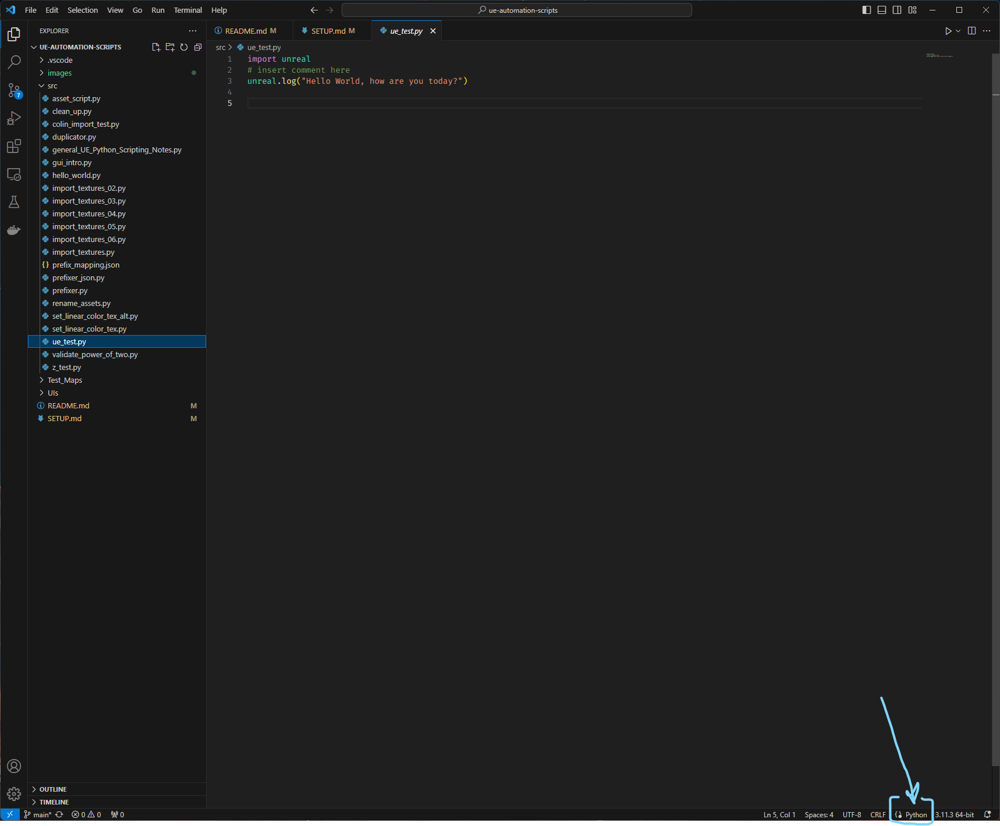  

- Select ***Enter Interpreter Path...***  

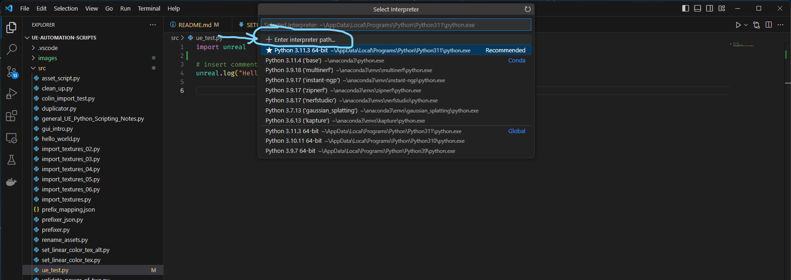  

- Then press the ***Find*** item to open the file browser dialog
- A windows path dialog box should open, navigate to the following location:
    - {Unreal Software Install Dir}\Engine\Binaries\ThirdParty\Python3\Win64\python.exe
- Here is an example for my workstation:
    - E:\01_EpicGames\UE_5.3\Engine\Binaries\ThirdParty\Python3\Win64\python.exe  

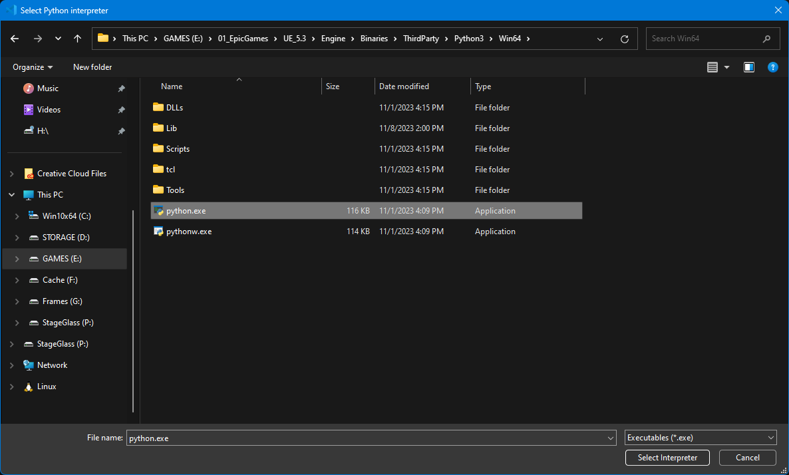 

This completes the setup process. The user should now be able to write python code within Visual Studio Code using the embedded version of Python used by Unreal. Additionally, the user should have a functioning autocomplete for the Unreal API and use the shortcut keys: *Ctrl + Enter* to send the script to the Unreal editor for execution.

**NOTE:** The code needs to be saved before sending to Unreal, otherwise any edits will not be reflected when sending to Unreal.